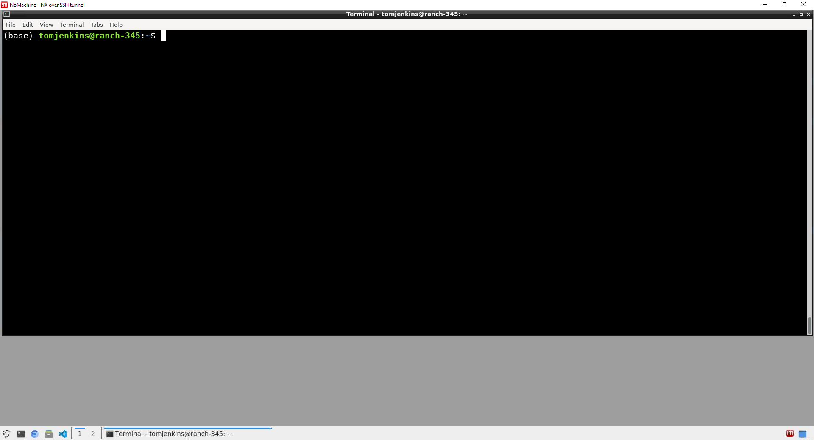

```{r setup, include=FALSE}
# Remove hashes from code output
knitr::opts_chunk$set(comment = NA)
```

```{r, echo=FALSE}
# Add APHA logo to the top-right
htmltools::img(src = knitr::image_uri("./images/APHA_logo.jpg"),
               alt = "logo",
               style = "position:absolute; top:0; right:0; padding:10px;
                        width:180px")
```

```{css, echo=FALSE}
/* Enforce period after section number */
.header-section-number::after {
  content: ".";
}
```

<!-- START OF RMARKDOWN DOCUMENT -->
Bioinformatics User Development (BUD) tutorials provide online material to support beginners and existing users develop and apply their bioinformatics skills to the analysis of sequence data that are routinely generated by the Animal and Plant Health Agency (APHA).

<br>

**Prerequisites for this tutorial:**  

* A Linux (Ubuntu) machine set up on the Scientific Computing Environment ([SCE](https://defra.sharepoint.com/teams/Team741/SitePages/Home.aspx?xsdata=MDN8MDF8fDU0YjMzYmFlODc0ODRkZmI5OTdhZGVlODE2OGU3ZjBlfDc3MGEyNDUwMDIyNzRjNjI5MGM3NGUzODUzN2YxMTAyfDB8MHw2Mzc4NjEzNzk4NzY5NDY0ODl8R29vZHxWR1ZoYlhOVFpXTjFjbWwwZVZObGNuWnBZMlY4ZXlKV0lqb2lNQzR3TGpBd01EQWlMQ0pRSWpvaVYybHVNeklpTENKQlRpSTZJazkwYUdWeUlpd2lWMVFpT2pFeGZRPT0%3D&sdata=R2hJZDYzSkRXRXlKU2dtMTJMaHFGZ1lYY1NaVytmc2pPQmxoSVNWNE9hOD0%3D&ovuser=770a2450-0227-4c62-90c7-4e38537f1102%2CTom.Jenkins%40apha.gov.uk&OR=Teams-HL&CT=1650542358130&params=eyJBcHBOYW1lIjoiVGVhbXMtRGVza3RvcCIsIkFwcFZlcnNpb24iOiIyNy8yMjAzMDcwMTYxMCJ9))
* NoMachine installed and set up on your laptop to allow you to remotely connect to your SCE machine ([BUF Help Docs](https://defra.sharepoint.com/:f:/s/MST-APHA-BioinformaticsUserForum/Elk6sTYK4vhPqPPCHL8JBqEBZdbUGX74fn6XwAFT1b9ROg?e=yCTY5r))
* Some background knowledge of DNA and sequencing
* 1GB storage space available on your SCE machine

<br>

# Introduction
The aim of this BUD tutorial is to give users an introduction to the Linux command-line and to some of the common operations used in the analysis of sequencing data. The tutorial will take approximately two hours to complete.

<br>

## Terminology
| Term | Description |
| -- | ----------- |
| **Computer** |
| Linux | A Unix-based operating system. Microsoft Windows and Mac OS are other examples of an operating system.
| Ubuntu | A distribution (version) of Linux.
| Terminal | A terminal is an interface to the underlying operating system via a command-line interpreter. Humans interact with the terminal by typing commands into the command-line. When a command is typed and then executed, the terminal’s command-line interpreter (usually Bash), attempts to run the command.
| Bash | The most common command-line interpreter for Linux. It is the default in Ubuntu. The name is an acronym for the 'Bourne-Again SHell'.
| Path | A path is the complete location of where a directory or file is located. For example, `/home/username/` is the absolute path to the location of a users home directory on a Linux computer.
| **Sequencing** |
| DNA | Deoxyribonucleic acid. |
| DNA sequencing | A technique for determining the exact sequence of nucleotides, or bases, in a DNA molecule.
| Read | A partial sequence of a single DNA fragment. |
| Read length | The number of base pairs (bp) sequenced from a DNA fragment. In short-read DNA sequencing experiments, modern-day read lengths are typically in the range of 100-250bp. | 

<a href="#top">Back to Contents</a>

<br>


## Linux overview
Linux is an operating system, just like Microsoft Windows, iOS and Mac OS. [Ubuntu](https://ubuntu.com/) is a distribution (version) of Linux and is currently the primary distribution used on the SCE.


<iframe width="100%" height="500px" src="https://www.youtube.com/embed/I8ik8pDTgJE" data-external="1" frameborder="0" allowfullscreen> </iframe>
<blockquote> 5-minute video introducing Linux operating systems </blockquote>

<a href="#top">Back to Contents</a>

<br>

**File structure**

{width=90%}

> The [Linux file structure](https://en.wikipedia.org/wiki/Filesystem_Hierarchy_Standard) arranged in a hierarchical tree --- blue boxes denote directories that can be created in the user's home directory

When a new terminal is opened you will usually start off in `/home/username`. The `/home` folder contains a directory (folder) for each user account on the system. In the terminal, directory names are separated by a `/` with no spaces in between names. Users will rarely need to interact with or know about the other directories outside of their home directory. In case you are interested, below is a brief description of each directory presented in the hierarchical tree.

<!-- | Directory | Function | -->
<!-- | :- | :----- | -->
<!-- | /usr | General software is installed here. -->
<!-- | /lib | Important system software libraries are stored here. -->
<!-- | /bin | Software that is vital for the system to be able to boot is stored here. -->
<!-- | /boot | Contains important files to boot the computer. -->
<!-- | /dev | Files that represent a device (e.g. webcam) on your system have an entry in this folder. -->
<!-- | /etc | System-wide configuration files for the software installed on your system are stored here. -->
<!-- | /home | Each user account on the system has a home directory that is stored here. -->

```{r, eval=TRUE, echo=FALSE}
library(gt)
library(magrittr)
tibble::tribble(
  ~Directory, ~Function,
  "/usr ", "General software is installed here",
  "/lib", "Important system software libraries are stored here",
  "/bin", "Software that is vital for the system to be able to boot is stored here",
  "/boot", "Contains important files to boot the computer",
  "/dev", "Files that represent a device (e.g. webcam) on your system have an entry in this folder",
  "/etc", "System-wide configuration files for the software installed on your system are stored here",
  "/home", "Each user account on the system has a home directory that is stored here"
  ) %>% 
  gt() %>% 
  cols_align(
    align = "left"
  )
```

<a href="#top">Back to Contents</a>

<br>

**The terminal**

The Linux terminal is a text-based interface used to control a Linux computer. It can sometimes be referred to as the console, shell, prompt, or various other names. It allows the user, through the command-line, to directly create or delete files / directories, (un)install software, manipulate files, execute programs, and much more. 

Note that as you execute commands though the command-line you will progress down the terminal window. To completely clear a terminal of all past commands and outputs, use the shortcut `crtl+L` or type `clear` into the console.


{width=100%}
<blockquote> Linux terminal on the SCE </blockquote>
<a href="#top">Back to Contents</a>

<br>

# The command-line
The command-line allows the user to type a command and the computer then interprets that command to perform a particular task. In Ubuntu, the default interpreter is Bash. 

For example, to command the computer to print "The Animal and Plant Health Agency" type the following into the console:
```{bash eval=TRUE}
echo "The Animal and Plant Health Agency"
```
The command `echo` prints text contained within single or double quotes (a string) to standard output, represented above by the black background.

*What is standard output?*  
Standard output, or `stdout` for short, is text output to the terminal that is produced from the command you executed. In addition, there is standard input, or `stdin` for short, where a command expects text input in a particular format to perform a task.

<br>

<blockquote> **Tips** <br> `~` (tilde) represents the user's home directory, usually `/home/username`. <br> `.` (dot) represents the current directory you are in. <br> `..` (dot dot) represents the parent directory of the current directory you are in. <br> `<tab>` press the tab key to autocomplete file and directory names while on the command-line. <br> `cmd` is usually an abbreviation for command or command prompt. <br>  `ctrl+c` press control+c to stop the current command / process in the terminal. <br> `#` (hash) text that follows a hash is a comment and not interpreted by Bash. </blockquote>

<a href="#top">Back to Contents</a>

<br>

**Quick examples of executing commands**

Print the path of the working directory (the directory you are currently in)
```{bash, eval=TRUE}
pwd

# Note: you can also use echo and $PWD for this, which can be useful in Bash scripts (section 4.1)
echo $PWD
```

List all files in the current directory
```{bash, eval=FALSE}
ls 
```
```{bash, eval=TRUE, echo=FALSE}
ls -C
```

Make a new directory called `new_dir` and list current directory contents
```{bash eval=FALSE}
mkdir new_dir
# Note: ls and ls . both list the contents of the current directory
ls .
```
```{bash, eval=TRUE, echo=FALSE}
mkdir new_dir
ls -C
```

1. Navigate into the new directory  
2. Print the working directory  
3. Navigate back to the parents directory  
4. (Re)print the working directory  
5. Remove the `new_dir` directory  
```{bash, eval=TRUE}
cd new_dir/ # 1.
pwd # 2.
cd .. # 3. (.. means go back to the parent directory)
pwd # 4.
rm -r new_dir/ # 5.
```

<a href="#top">Back to Contents</a>

<br>


## Table of common commands

| Command | Function | Example Usage
| :-- | :----- | :---
| **Navigation** | |
| `pwd` | print working directory | `pwd`
| `ls` | list contents (of directory) | `ls [OPTIONS]`
| `cd` | change directory | `cd toHere/`
| **File/Folder Actions** | |
| `mkdir` | make (new) directory | `mkdir newDir`
| `cp` | copy file or directory | `cp thisFile toHere/` <br> `cp -r thisDir/ toHere/`
| `mv` | move file or directory | `mv thisFile toHere/` <br> `mv thisDir/ toHere/`
| `rm` | remove file or directory <br> (warning: `rm` is irreversible) | `rm file` <br> `rm -r directory/` 
| `head` | print the first 10 lines of a file to `stdout` | `head file`
| `more` | interactively scroll through file contents, press `enter` to scroll down and `q` to exit | `more file`
| `cat` | concatenate file(s) to `stdout` | `cat file1 file2`
| **File Manipulation** | |
| `grep` | search for patterns in a file | `grep [OPTIONS] "PATTERN" file`
| `sed` | stream editor, enables many functions, e.g. find and replace | `sed 's/search/replace/g' file`
| `awk` | multifunctional command | `awk '{FUNCTION}' file`
| `|` | send (pipe) the standard output from `cmd1` to `cmd2` | `cmd1_stdout | cmd2_stdin`
| `>` | save standard output to a file | `cmd1_stdout > output.txt`
| `wc` | word count | `wc [OPTIONS] file`
| `cut` | subset and print lines to `stdout` | `cut [OPTIONS] file`
| `uniq` | filter by unique lines and print to `stdout` | `cat file | uniq [OPTIONS]`
| `sort` | sort lines  and print to `stdout` | `sort [OPTIONS] file`
| `tr` | Translate and print to `stdout` <br> e.g. convert csv to tsv | `cat file.csv | tr "," "\t"`
| **File Download** | |
| `wget` | download file from url | `wget [OPTIONS] <url>`
| `curl` | download file from url | `curl [OPTIONS] <url>`
| **Compression** | |
| `gzip` | compress file(s) | `gzip [OPTIONS] file1 file2`
| `gunzip` | decompress file(s) | `gunzip [OPTIONS] file1 file2`
| `tar` | decompress a tar file <br> decompress a tar and gzipped file <br> create archive.tar from two files | `tar -xvf file.tar` <br> `tar -xvzf file.tar.gz` <br> `tar -cvf archive.tar file1 file2`

> Note: `cmd [OPTIONS]` the square brackets in this notation refer to arguments you can add that change the output of a command. For example, `ls -1` lists all files and directories in the current directory per line.

<a href="#top">Back to Contents</a>

<br>


## Help documents and arguments

**Getting help**  
If you are uncertain what a particular command does, there are two options: search the internet or get help directly from the terminal. For example, if you type `man ls` or `ls --help` into the console, you will get information about the `ls` command and how to use it. Additionally, most external software that you install will also have help documents that you can access directly from the terminal, usually by typing either `programX -h` or `programX --help`.

**Arguments**  
Arguments are options that you can add to commands that change the output. These are usually expressed as a dash or a double dash followed by the argument identifier (with no spaces). The options available to include as an argument for a particular command are typically located in the help documentation for that command. Arguments usually offer a short notation which is a single dash followed by a single character (e.g. `-h`) and a long notation which is two dashes followed by two or more characters that is usually more informative and easier to interpret its function (e.g. `--help`).

**Useful arguments for `ls` and `cd`**

List all files in the current directory per line
```{bash, eval=TRUE}
ls -1
```

Count the number of files in the current directory
```{bash, eval=TRUE}
# Print all files per line and then count the number of lines
ls -1 | wc -l
```

List more information in human-readable format
```{bash, eval=TRUE}
ls -lh
```

Shortcut to change to your home directory
```{bash, eval=TRUE}
# Note: cd ~ is equivalent to typing cd
cd ~
pwd
```

Shortcut to change back to the previous directory you were in (`cd -`)
```{bash, eval=TRUE}
# Print working directory
pwd
# Change to a different directory on your system
cd ~/software
# Print working directory
pwd
# Use cd - to quickly change back to the previous directory
cd -
```

<a href="#top">Back to Contents</a>

<br>


## Other useful commands

Print the total, used and available storage space on your instance
```{bash, eval=TRUE}
df -h .
```

Print the total space used by all files and subdirectories in the current directory
```{bash, eval=TRUE}
du -h --total .
# Note: add the -a argument to print the space used per file and directory
```

Print the command history to the console
```{bash, eval=FALSE}
history
```

Find past uses of the `ls` command in the history
```{bash, eval=FALSE}
# Print history and pipe stdout to grep command
# Match only lines with the pattern "ls" and print to stdout
history | grep "ls"
```

Print the date to the console
```{bash, eval=TRUE}
date
```

Enable access permissions for user to execute file
```{bash, eval=FALSE}
# For more information follow this URL:
# https://www.gnu.org/software/coreutils/chmod
chmod u+x file
```

Print the number of cpu processors to the console
```{bash, eval=TRUE}
# Print cpu info and pipe stdout to grep command
# Match only lines with the pattern "processor" and pipe stdout to wc command
# Count the number of lines (i.e. the number of times "processor" was matched)
cat /proc/cpuinfo | grep "processor" | wc -l
```


Create a symbolic link (also known as a soft link) to a directory

_Imagine that you have a very long path to a directory on your system; for example, `home/username/projectA/experimentX/run1/sequences/consensus/`. It may be useful to create a link to this directory so that you can easily go straight to this directory from your home directory. The `ln` command allows you to do this. The syntax is `ln -s path/to/directory/ name_of_link`_.

```{bash, eval=TRUE}
# Change to the home directory
cd ~
# Create a symbolic link to the tutorials/ directory
ln -s /home/tomjenkins/bioinformatics-user-development/tutorials bud_tutorials
# Use the soft link to change tutorials/ from the home directory
cd bud_tutorials
pwd
```
This worked but why are the directories `/bioinformatics-user-development/tutorials` not in the path? And why is the directory seemingly called bud_tutorials now? Important: the directory names have not changed, rather bud_tutorials is now representing the path `/bioinformatics-user-development/tutorials`. The actual paths are not shown by `pwd` or `cd` when a symbolic link is used to change directory, unless you specifically ask for a hard link. If you want to use a symbolic link for navigation but also want to keep full physical paths, you can add the `-P` argument:
```{bash, eval=TRUE}
# Same as above but use the -P argument in pwd to print the full path
cd ~/bud_tutorials # remember: ~ represents /home/username
pwd -P
```
```{bash, eval=TRUE}
# Keep the full path when using a soft link to change directory
cd -P ~/bud_tutorials
pwd
```
To delete a soft link, you can type the following:
```{bash, eval=TRUE}
rm ~/bud_tutorials
```

> Tip: see `pwd --help` and `cd --help` for more details about the `-P` argument

<a href="#top">Back to Contents</a>

<br>


# Common operations with sequencing data
In this section, to demonstrate common operations performed on sequencing data, we will download and explore FASTQ, FASTA and GFF files. The format of each file type is explained below.

**FASTQ format**  
A FASTQ file is a text file that stores a sequence and its corresponding Phred quality scores. The Phred scores are the same length as the sequence and represent the accuracy of each base called in the sequence. The FASTQ format encodes Phred scores (Q) as ASCII characters (see this [table](http://drive5.com/usearch/manual/quality_score.html) for more details). For instance, the ASCII characters `&` and `D` represent a Phred score of 5 and 36, respectively. 

An entry in a FASTQ file consists of four lines:

* Line 1: begins with a `@` character followed by a sequence identifier
* Line 2: is the actual sequence of letters (base calls)
* Line 3: begins with a `+` and usually just represents a separator
* Line 4: contains the Phred quality scores encoded as ASCII characters

```
@SEQ_ID
GAGACTTGTC
+
F==AAFFFGB
```

This is a simple example of a FASTQ file. It contains a single sequence 10 bases in length together with its corresponding ASCII characters --- the table below shows the accompanying Phred scores following ASCII_BASE 33 conversion (this is the encoding now universally used in next generation sequencing).

```{r, eval=TRUE, echo=FALSE}
library(gt)
library(magrittr)
tibble::tribble(
  ~`Position in sequence`, ~`Base call`, ~`ASCII character`, ~`Phred score`,
  1, "G", "F", 37,
  2, "A", "=", 28,
  3, "G", "=", 28,
  4, "A", "A", 32,
  5, "C", "A", 32,
  6, "T", "F", 37,
  7, "T", "F", 37,
  8, "G", "F", 37,
  9, "T", "G", 38,
  10, "C", "B", 33
  ) %>% 
  gt() %>% 
  cols_align(
    align = "left"
  )
```
> Note: raw FASTQ outputs from a sequencer will contain sequences the same length as the chemistry used in the sequencing experiment. For example, if 150 cycles are used to generate paired-end read data (2x150bp) then all sequence lengths will be 150 base pairs in the raw FASTQ files.

<a href="#top">Back to Contents</a>

<br>

**FASTA format**  
A FASTA file is a text file that stores only sequence information. An entry in a FASTA file consists of two lines:

* Line 1: begins with a `>` character followed by a sequence identifier
* Line 2: is the actual sequence of letters (can represent DNA, RNA, protein, etc.)

```
>SEQ_ID_1
GAGACTTGTC
>SEQ_ID_2
TACTGCCCAA
>SEQ_ID_N
TAGCCTTACG
```

<a href="#top">Back to Contents</a>

<br>

**General Feature Format (GFF)**  
A General Feature Format (GFF) file is a tab-delimited file that consists of one line per feature (e.g. a predicted gene) and nine mandatory columns of data. GFF is typically used to store gene prediction and annotation information. Although a few variations of GFF exist, GFF3 is now universally accepted and should be used in all analyses. The GFF3 format is as follows:

```{r, eval=TRUE, echo=FALSE}
library(gt)
library(magrittr)
tibble::tribble(
  ~Column, ~Name, ~Description,
  1, "seqid", "name of sequence where feature is located",
  2, "source", "source of the feature (e.g. a program such as Augustus or RepeatMasker)",
  3, "type", "type of feature (e.g. gene, exon, mRNA, etc.)",
  4, "start", "start coordinates of feature",
  5, "end", "end coordinates of feature",
  6, "score", "score of the feature",
  7, "strand", "strand of the feature (e.g. + for positive stand, - for negative stand)",
  8, "phase", "phase of CDS (coding sequence) feature",
  9, "attributes", "a list of additional information about this feature in the format tag=value"
  ) %>% 
  gt() %>% 
  cols_align(
    align = "left"
  )
```
<blockquote>
Click [here](https://github.com/The-Sequence-Ontology/Specifications/blob/master/gff3.md) for more details about GFF3
</blockquote>

<a href="#top">Back to Contents</a>

<br>

## Download data from the SRA
The Sequence Read Archive ([SRA](https://www.ncbi.nlm.nih.gov/sra)) is a National Center for Biotechnology Information (NCBI) database that stores sequence data obtained from next generation sequence technology. You can download data (usually in FASTQ format) using one of the following programs: [sra-tools](https://github.com/ncbi/sra-tools) (NCBI) or [fastq-dl]() (open-source).

We will download sequence data for bovine tuberculosis (*Mycobacterium bovis*) from the SRA by parsing accession numbers. The accession number is an ID that is unique to a particular Project (Study), Sequencing Experiment or Sequencing Run. Therefore, this is what we use when downloading sequencing data for a study or sample(s) of interest.

Accession ID for each level:

* Project: [PRJNA804719](https://www.ncbi.nlm.nih.gov/bioproject/PRJNA804719)
* Experiment: [SRX14525734](https://www.ncbi.nlm.nih.gov/sra/SRX14525734[accn])
* Run: [SRR18391668](https://trace.ncbi.nlm.nih.gov/Traces/index.html?view=run_browser&acc=SRR18391668&display=metadata)


<br>

### SRA-TOOLS

**Installation**  
One way to install sra-tools is to navigate to the SRA-Toolkit [installation page](https://github.com/ncbi/sra-tools/wiki/02.-Installing-SRA-Toolkit), copy the hyperlink titled "sratoolkit.current-ubuntu64.tar.gz", and then follow the commands below:
```{bash, eval=FALSE}
# This command will download the tar-zipped file to the current directory you are in
wget sratoolkit.tar.gz https://ftp-trace.ncbi.nlm.nih.gov/sra/sdk/current/sratoolkit.current-ubuntu64.tar.gz
tar -xvzf sratoolkit.current-ubuntu64.tar.gz
rm sratoolkit.current-ubuntu64.tar.gz

# This command enables you to use sra-tools commands from any directory
# More specifically, it adds the path of where the sra-tools commands are (e.g. fasterq-dump) to the executable path list
# The >> ~/.bashrc means append this command to your .bashrc file
# The .bashrc is run each time you start-up your instance, so this makes this action permanent
# The source ~/.bashrc means re-run the .bashrc script
echo 'PATH="$HOME/software/sratoolkit.3.0.0-ubuntu64/bin:$PATH"' >> ~/.bashrc
source ~/.bashrc
```
> Note: you will need to edit the PATH to where your sratoolkit.X.X.X-ubuntu64/bin is located and ensure the version number is the same as the one you downloaded

Further information on how to install the programs onto your SCE instance is available from the [BUF Help Docs](https://defra.sharepoint.com/:f:/s/MST-APHA-BioinformaticsUserForum/Elk6sTYK4vhPqPPCHL8JBqEBZdbUGX74fn6XwAFT1b9ROg?e=yCTY5r).

<br>

**Download reads**  
Download paired reads for a single sequencing run to the current directory
```{bash, eval=FALSE}
fasterq-dump --split-files --outdir . --threads 4 SRR18391668 
```

```{r, eval=TRUE, echo=FALSE}
library(gt)
library(magrittr)
tibble::tribble(
  ~Argument, ~Description,
  "--split-files", "download two separate files for paired reads (a forward and reverse read)",
  "--outdir", "path to the directory to store output files",
  "--threads", "number of processors to use"
  ) %>% 
  gt() %>% 
  cols_align(
    align = "left"
  )
```
> Note: the default for `fasterq-dump` is to download unzipped fastq files

<br>

### FASTQ-DL

**Installation**  
One way to install fastq-dl is to via conda from the [Bioconda](https://bioconda.github.io/) channel. By following the commands below, you will set up a conda environmental called fastq-dl which downloads fastq-dl and all of its dependencies to the fastq-dl environment.

```{bash, eval=FALSE}
conda create -n fastq-dl -c conda-forge -c bioconda fastq-dl
conda activate fastq-dl
```
> Note: installing via conda requires you to have installed miniconda3 or miniforge3
>
> Tip: to deactivate a conda environment type `conda activate base`

Further information on how to install the programs via conda is available from the [BUF Help Docs](https://defra.sharepoint.com/:f:/s/MST-APHA-BioinformaticsUserForum/Elk6sTYK4vhPqPPCHL8JBqEBZdbUGX74fn6XwAFT1b9ROg?e=yCTY5r).

<br>

**Download reads**  
Download paired reads for a single sequencing run to the current directory
```{bash, eval=FALSE}
fastq-dl --outdir . --cpus 4 SRR18391668 SRA
```

```{r, eval=TRUE, echo=FALSE}
library(gt)
library(magrittr)
tibble::tribble(
  ~Argument, ~Description,
  "--outdir", "path to the directory to store output files",
  "--cpus", "number of processors to use"
  ) %>% 
  gt() %>% 
  cols_align(
    align = "left"
  )
```
> Note: the default for fastq-dl is to download two separate gzipped fastq files for paired reads

You can also specify a Project accession ID or an Experiment accession ID. For example, supplying the Project accession, PRJNA804719, tells the program to download all 136 sequencing experiments to the current directory. Similarly, supplying the Experiment accession, SRX14525734, tells the program to download all sequencing runs for that experiment. In the example used here, there is only one run in the experiment so only one sample of paired reads will be downloaded; however, when there are multiple sequencing runs for an experiment (more common in genome assembly studies) all of these will be downloaded when the Experiment accession is supplied.
```{bash, eval=FALSE}
# Download all sequencing experiments for Project PRJNA804719
fastq-dl --outdir . --cpus 4 PRJNA804719 SRA
# Download all sequencing runs for Experiment SRX14525734
fastq-dl --outdir . --cpus 4 SRX14525734 SRA
```


<a href="#top">Back to Contents</a>

<br>

## Download data from GenBank
[GenBank](https://www.ncbi.nlm.nih.gov/genbank/) is a genetic sequence database on the NCBI. It is designed to "*provide and encourage access within the scientific community to the most up-to-date and comprehensive DNA sequence information*". You can download data using the command-line tools provided by Entrez Direct ([EDirect](https://www.ncbi.nlm.nih.gov/books/NBK179288/)). 

**Installation**  
To install EDirect tools to your home directory, follow the commands below:
```{bash, eval=FALSE}
sh -c "$(curl -fsSL ftp://ftp.ncbi.nlm.nih.gov/entrez/entrezdirect/install-edirect.sh)"
# Type "y" and press the Return key to add the path to your .bashrc file
# Type "N" if you want to move the edirect folder and manually add a path to your .bashrc file
```

Examples of what can you download from GenBank:

* Nucleotide DNA sequences (nuclear and organelle)
* Protein sequences
* Gene
* Genome assembly

<br>

**Download 16S rRNA**  
Download five 16s rRNA sequences for _Salmonella enterica_ from [here](https://www.ncbi.nlm.nih.gov/nuccore/?term=Salmonella+enterica+16S+rRNA)
```{bash, eval=FALSE}
efetch -db nucleotide -id AF276989,NR_074799,NR_041696,NR_074910,NR_119108 -format fasta > Senterica_16S.fa
```

**Download complete mitogenome**  
Download the mitochondrion complete genome for _Homarus gammarus_ from [here](https://www.ncbi.nlm.nih.gov/nuccore/MH747083.1)
```{bash, eval=FALSE}
efetch -db nucleotide -id MH747083 -format fasta > Hgammarus_mitogenome.fa
```

**Download protein sequence**  
Download the protein sequence for myogenic factor 5 (*Bos taurus*)  from [here](https://www.ncbi.nlm.nih.gov/protein/NP_776541.1)
```{bash, eval=FALSE}
efetch -db protein -id NP_776541 -format fasta
```

**Download gene information**  
Download information for the _Mycobacterium bovis_ Mbis1 gene from [here](https://www.ncbi.nlm.nih.gov/gene/?term=Mycobacterium+bovis)
```{bash, eval=FALSE}
efetch -db gene -id "492906" -format tabular
# OR
esearch -db gene -query "Mycobacterium bovis Mbis1" | efetch -format tabular
```

**Download genome assembly**  
Download _Mycobacterium bovis_ genome assembly (GCA_005156105.1) from [here](https://www.ncbi.nlm.nih.gov/assembly/GCF_005156105.1)
```{bash, eval=FALSE}
wget $(esearch -db assembly -query "GCA_005156105.1" | esummary | xtract -pattern DocumentSummary -element FtpPath_RefSeq | awk -F"/" '{print $0"/"$NF"_genomic.fna.gz"}')
```

> Tip: you can supply a text file with IDs to the `efetch` `-input` argument, which allows you to download multiple files and avoid manually typing IDs on the command-line
>
> Further information for downloading data via EDirect can be found on the following pages:
>
>> https://www.ncbi.nlm.nih.gov/books/NBK179288/
>> https://github.com/NCBI-Hackathons/EDirectCookbook

<a href="#top">Back to Contents</a>

<br>


## Compress & decompress files
If you download sequence data with `fastq-dl` the files will be gzipped by default. Although many bioinformatics programs accept gzipped FASTQ / FASTA files, there may be instances where you need to unzip these files. To decompress all gzipped files in a directory run the following:
```{bash, eval=FALSE}
# Note: the asterisk (*) instructs Bash to apply this command to all files ending in .fastq.gz
gunzip *.fastq.gz
```

If you download sequence data with `fasterq-dump` the files will be unzipped by default. To compress all FASTQ files run the following:
```{bash, eval=FALSE}
# Note: the asterisk (*) instructs Bash to apply this command to all files ending in .fastq
gzip *.fastq
```

<a href="#top">Back to Contents</a>

<br>


## Manipulate FASTQ & FASTA files
This section presents some common operations with FASTQ and FASTA files using the Bash commands covered in section [2.1](#table-of-common-commands). We will use the FASTQ files downloaded in section [3.1](#download-data-from-the-sra) and the FASTA files downloaded in section [3.2](#download-data-from-genbank).

<br>

### View the first read in a FASTQ file
```{bash, eval=TRUE}
# Pipe the output from zcat to head and print the first four lines
zcat SRR18391668_1.fastq.gz | head -n 4
```
> Note: `zcat` is required to send contents of a compressed file to `stdout`

<br>

### Count the number of sequences

**FASTQ file**
```{bash, eval=TRUE}
# Pipe the output from zcat to grep and count the number of lines that start "@" or "@SRR"
# Note: the ^ means only match at the start of a line
zcat SRR18391668_1.fastq.gz | grep -c "^@"
zcat SRR18391668_1.fastq.gz | grep -c "^@SRR"
```
Why are there two different counts? The correct number of reads is the second number (containing overall less reads). For the first number, there are (erroneously) more reads counted when using only `"^@"` because `@` can also a Phred score (31), so if the quality score (line 4) starts with a score of 31 it will be represented by a `@` which would be erroneously be counted as a read. To overcome this issue, we can append more characters from the FASTQ header to be confident only the sequence reads are counted and not any Phred scores that start with `@`.

**FASTA file**
```{bash, eval=TRUE}
# Count the number of ">"
grep "^>" -c Senterica_16S.fa

# Note: to print only the sequence IDs remove the -c argument
grep "^>" Senterica_16S.fa
```

<br>

### Print the read length

**FASTQ file**
```{bash, eval=TRUE}
# Pipe output from zcat to grep
# Only keep the line starting with "@SRR" and the line after (grep -A 1)
# Remove lines starting with "@SRR" (grep -v)
# Remove lines starting with "--" (grep -v)
# Keep only the first sequence (head -n 1)
# Print the number of characters using awk (i.e. the read length in base pairs)
zcat SRR18391668_1.fastq.gz | grep -A 1 "^@SRR" | grep -v "^@SRR" | grep -v "^--" | head -n 1 | awk '{print length}'

# Note: to print only the sequence remove the awk command
zcat SRR18391668_1.fastq.gz | grep -A 1 "^@SRR" | grep -v "^@SRR" | grep -v "^--" | head -n 1
```

> Tip: it is highly recommended to run each command in between the pipes separately so that you understand what each command is doing.
> 
> For example, you could run the following lines of code:

```{bash, eval=FALSE}
zcat SRR18391668_1.fastq.gz | head
zcat SRR18391668_1.fastq.gz | grep -A 1 "^@SRR" | head
zcat SRR18391668_1.fastq.gz | grep -A 1 "^@SRR" | grep -v "^@SRR" | head
zcat SRR18391668_1.fastq.gz | grep -A 1 "^@SRR" | grep -v "^@SRR" | grep -v "^--" | head 
```

**FASTA file**  
Printing the read length of sequences in FASTA files is more difficult using Bash commands because in FASTA files the sequence can either be (i) on one line, or (ii) on multiple lines where each line usually contains a maximum of 70 characters. The latter is more common, which makes it is more challenging to use Bash commands to assess read length. However, external programs such as SeqKit (section [4.3](#seqkit)) provide commands to easily extract such information.

<br>

### Combine multiple FASTA files into a single FASTA file
```{bash, eval=FALSE}
# Concatenate both files and save as a new file
cat Senterica_16S.fa Hgammarus_mitogenome.fa > concatenated_file.fa
```

<br>

### Convert a FASTQ to a FASTA file
```{bash, eval=TRUE}
# 1~4s/^@/>/p = the expression that creates the FASTA header
# semi-colon = separates simple commands within sed
# 2~4p = the expression that creates the FASTA sequences
# Save the stdout in a new file
zcat SRR18391668_1.fastq.gz | sed -n '1~4s/^@/>/p;2~4p' > SRR18391668_1.fa

# Check that the number of reads is equal
zcat SRR18391668_1.fastq.gz | grep -c "^@SRR"
grep -c "^>" SRR18391668_1.fa
```
> This command was obtained from this [post](https://stackoverflow.com/questions/1542306/converting-fastq-to-fasta-with-sed-awk) on stackoverflow. The authors translation is as follows: *starting on line 1, and every 4th line thereafter, when you see a @ character at the beginning of a line, substitute it with a > character, and print the resulting line; then, starting at line 2, and every 4th line thereafter, just print the line". The -n option turns off automatic printing, and the 'p' in the two sed expressions selectively prints lines that match the expression*.

<a href="#top">Back to Contents</a>

<br>


## Extract information from a gene annotation file
This sections presents some operations on GFF files using the Bash commands covered in section [2.1](#table-of-common-commands). To do this, we will download a GFF3 file from The Arabidopsis Information Resource ([TAIR](https://www.arabidopsis.org/)), which is a genetic and molecular biology database for the model higher plant _Arabidopsis thaliana_.

**Download a GFF file from TAIR to the current directory**
```{bash, eval = FALSE}
wget https://www.arabidopsis.org/download_files/Genes/TAIR10_genome_release/TAIR10_gff3/TAIR10_GFF3_genes.gff
```

**Print the first five lines of the file**
```{bash, eval = TRUE}
head -n 5 TAIR10_GFF3_genes.gff
```

**Print the names of the chromosomes**
```{bash, eval = TRUE}
# Pipe the stdout to cut and subset the first column
# Print unique lines
cat TAIR10_GFF3_genes.gff | cut -f 1 | uniq
```

**Count all predicted features**
```{bash, eval = TRUE}
# Pipe the stdout to cut and subset the third column
# Sort the output and then count unique lines
cat TAIR10_GFF3_genes.gff | cut -f 3 | sort | uniq -c
```

> Tip: it is highly recommended to run each command in between the pipes separately so that you understand what each command is doing.
> 
> For example, you could run the following lines of code:

```{bash, eval = FALSE}
cat TAIR10_GFF3_genes.gff | head
cat TAIR10_GFF3_genes.gff | cut -f 3 | head
cat TAIR10_GFF3_genes.gff | cut -f 3 | sort | head
```

<br>

**Count the number of predicted genes**
```{bash, eval = TRUE}
# Same as above but use grep to only print lines that match "gene"
cat TAIR10_GFF3_genes.gff | cut -f 3 | sort | uniq -c | grep "gene"
```
> Note: `grep` character matching will find all occurrences of "gene"
>
> To ensure only the whole word "gene" is matched add the `-w` argument (whole words)

```{bash, eval = TRUE}
cat TAIR10_GFF3_genes.gff | cut -f 3 | sort | uniq -c | grep -w "gene"
```

<br>

**Extract predicted genes**
```{bash, eval = FALSE}
# Pipe the stdout to awk
# Subset rows that have the word "gene" in column 3 ($3)
# Save stdout in a new file
# Note: this awk command searches for whole words by default
cat TAIR10_GFF3_genes.gff | awk '$3 == "gene"' > genes_only.gff
```

**Extract predicted genes from only chromosome 1**
```{bash, eval = FALSE}
# Same as above but also subset rows that have "Chr1" in column 1
cat TAIR10_GFF3_genes.gff | awk '$3 == "gene"' | awk '$1 == "Chr1"' > Chr1_genes_only.gff
```

**Search for the presence of a gene (AT2G02760)**
```{bash, eval = TRUE}
# Pipe the stdout to awk
# Subset rows that have the word "gene" in column 3 ($3)
# Print any rows that match "AT2G02760"
cat TAIR10_GFF3_genes.gff | awk '$3 == "gene"' | grep "AT2G02760"
```

<a href="#top">Back to Contents</a>

<br>


# Bonus

## Write and execute a Bash script
Bash scripting helps to automate repetitive tasks and chain commands together. A Bash script is a text file containing a set of commands and tasks to execute. The extension for Bash scripts is `.sh`, which is not necessary to run the script but it does allow the file to be easily identified.

The first line in a Bash script _is_ essential and is known as a "shebang":
```{bash, eval=FALSE}
#!/bin/bash
```
This instructs the program to interpret the code in the script as Bash.  

To demonstrate the use of a simple Bash script, imagine we wanted to execute several FASTQ operations presented in section [3](common-operations-with-sequencing-data). When dealing with very large data files, it is not efficient to type the commands one-by-one and wait for each command to finish (particularly when there are long run times), so instead we can instruct the computer to perform all of the tasks in sequential order. This means we do not have to be at our computer when tasks are running, which frees up time!

Launch a text editor from your SCE machine (e.g. [`nano`](https://www.nano-editor.org/), [`vim`](https://www.vim.org/), or an external editor such as [Visual Studio Code](https://code.visualstudio.com/)). Copy the following text into the text editor and save the file as `bash_script.sh` in the directory you are current working in. 

```{bash, eval=FALSE}
#!/bin/bash

# Error handling
# -e instructs Bash to exit immediately if any command has a non-zero exit status
# -o pipefail instructs Bash to return the value of the last command to exit with a non-zero status
set -e -o pipefail

# Create new directories to store input and output files
mkdir input_files
mkdir output_files

# Set parameters using the Bash programming language (note: no spaces either side of "=")
PROC=4 # number of processors to use
inDIR=$PWD/input_files # set input directory
outDIR=$PWD/output_files # set output directory

# Print $inDIR and $outDIR to the console on execution
echo $inDIR
echo $outDIR

# Download FASTQ reads to input_files directory
fasterq-dump --split-files --outdir $inDIR --threads $PROC SRR18391668

# Compress files
gzip $inDIR/*.fastq

# Count the number of sequences in both reads and save in a text file
zcat $inDIR/SRR18391668_1.fastq.gz | grep -c "^@SRR" > $outDIR/num_reads1.txt
zcat $inDIR/SRR18391668_2.fastq.gz | grep -c "^@SRR" > $outDIR/num_reads2.txt

# Print the read lengths in both reads and save in a text file
zcat $inDIR/SRR18391668_1.fastq.gz | grep -A 1 "^@SRR" | grep -v "^@SRR" | grep -v "^--" | awk '{print length}' > $outDIR/read_lengths1.txt
zcat $inDIR/SRR18391668_2.fastq.gz | grep -A 1 "^@SRR" | grep -v "^@SRR" | grep -v "^--" | awk '{print length}' > $outDIR/read_lengths2.txt

# Convert FASTQ to a FASTA file
zcat $inDIR/SRR18391668_1.fastq.gz | sed -n '1~4s/^@/>/p;2~4p' > $outDIR/SRR18391668_1.fa
zcat $inDIR/SRR18391668_2.fastq.gz | sed -n '1~4s/^@/>/p;2~4p' > $outDIR/SRR18391668_2.fa
```

To execute the Bash script, type the following while in the current working directory:
```{bash, eval=FALSE}
bash bash_script.sh
```
This will execute all the commands in the script!

<a href="#top">Back to Contents</a>

<br>


## Download files from AWS S3 buckets
The Amazon Web Service (AWS) Simple Storage Service ([S3]((https://aws.amazon.com/s3/))) is a cloud-based platform that is used by APHA to store sequencing data. You will need to get user access to specific S3 buckets via SCE [Support](https://defra.sharepoint.com/teams/Team741/SitePages/Support.aspx) in order to submit queries and download data files.

Once you have access to a particular S3 bucket, you will be able to execute the commands presented below. Ensure you edit the names and file paths according to the S3 bucket are are using.

**List project directories in a bucket**
```{bash, eval=TRUE}
# Note: the trailing / is required (s3://s3-csu-003/)
aws s3 ls s3://s3-csu-003/
```

**List information about files and file sizes in a directory**
```{bash, eval=TRUE}
# Note: --human-readable makes the file sizes easy to interpret
aws s3 ls s3://s3-csu-003/v3-2/Results_00522_24Jun22/ --summarize --human-readable
```

**Download a single file**
```{bash, eval=FALSE}
# This downloads a single FASTA file to the current working directory
aws s3 cp s3://s3-csu-003/v3-2/Results_00522_24Jun22/consensus/A20U004247_consensus.fas .
```

**Download all files**
```{bash, eval=FALSE}
# This downloads all files in consensus/ to the current working directory
aws s3 sync s3://s3-csu-003/v3-2/Results_00522_24Jun22/consensus/ .
```

**Download only FASTA files**
```{bash, eval=FALSE}
# Download all files and directories in Results_00522_24Jun22/
# --exclude "*" means exclude everything
# --include "*.fas" means include all files ending in .fas
# Note: you have to use both --exclude and --include to get this to work!
# Note2: this command also downloads the directory (consensus/) the FASTA files were in 
aws s3 sync s3://s3-csu-003/v3-2/Results_00522_24Jun22/ . --exclude "*" --include "*.fas"
```

Further information on how to transfer data is available from the [SCE Help Pages](https://defra.sharepoint.com/teams/Team741/SitePages/Help-articles.aspx) and the [BUF Help Docs](https://defra.sharepoint.com/:f:/s/MST-APHA-BioinformaticsUserForum/Elk6sTYK4vhPqPPCHL8JBqEBZdbUGX74fn6XwAFT1b9ROg?e=IFsvEl).

<a href="#top">Back to Contents</a>

<br>

## SeqKit
[SeqKit](https://bioinf.shenwei.me/seqkit/) is a fast toolkit for manipulating FASTQ and FASTA files. SeqKit provides a wealth of commands which speed up and streamline the analysis of FASTQ/A files, whilst also complementing the Bash commands you've learnt in this tutorial. In some cases, the commands from this toolkit will replace the need to write lengthy commands using Bash.

### Installation
One way to install SeqKit is to navigate to the SeqKit [download page](https://bioinf.shenwei.me/seqkit/download/), copy the hyperlink titled "seqkit_linux_amd64.tar.gz", and then follow the commands below:
```{bash, eval=FALSE}
# Note: your link maybe be slightly different to this one due to the version of SeqKit
wget https://github.com/shenwei356/seqkit/releases/download/v2.2.0/seqkit_linux_amd64.tar.gz
tar -xvzf seqkit_linux_amd64.tar.gz
rm seqkit_linux_amd64.tar.gz
sudo cp seqkit /usr/local/bin/
```

<a href="#top">Back to Contents</a>

<br>


### Examples of FASTQ/A analysis

**Print summary information**  
```{bash, eval=TRUE, engine.opts="-l"}
# Print summary information for all FASTQ and FASTA files in the current directory
seqkit stats *.fastq.gz *.fa
```

**Print the sequence of first entry**
```{bash, eval=TRUE, engine.opts="-l"}
# FASTQ
echo "FASTQ"
seqkit seq --seq SRR18391668_1.fastq.gz | head -n 1 # sequence
seqkit seq --seq SRR18391668_1.fastq.gz | head -n 1 | awk '{print length}' # sequence length

# FASTA
echo "FASTA"
seqkit seq --seq Senterica_16S.fa | head -n 1 # sequence
seqkit seq --seq Senterica_16S.fa | head -n 1 | awk '{print length}' # sequence length
```

**Print sequence ID**
```{bash, eval=TRUE, engine.opts="-l"}
# Print FASTQ sequence IDs for the first five reads
echo "FASTQ"
seqkit seq --name SRR18391668_1.fastq.gz | head -n 5

# Print FASTA sequence IDs for the first five sequences
echo "FASTA"
seqkit seq --name Senterica_16S.fa | head -n 5
```
> Note: one advantage of `seqkit seq --name` is that, unlike `grep`, the "@" or ">" is removed by default such that only the ID characters in the header are returned

**Get the reverse complement**
```{bash, eval=TRUE, engine.opts="-l"}
# Print the reverse complement of the first read
seqkit seq --seq SRR18391668_1.fastq.gz | head -n 1
seqkit seq --seq SRR18391668_1.fastq.gz --complement | head -n 1
```

**Convert a FASTQ to a FASTA file**
```{bash, eval=FALSE}
seqkit fq2fa SRR18391668_1.fastq.gz > SRR18391668_1.fa
```

**Randomly subsample sequences**
```{bash, eval=TRUE, engine.opts="-l"}
# Subsample 1000 reads from a FASTQ file
zcat SRR18391668_1.fastq.gz | seqkit sample -n 1000 | seqkit stats
```

**Subset sequences by length**
```{bash, eval=TRUE, engine.opts="-l"}
# Extract sequences >= 150bp
seqkit seq --min-len 150 SRR18391668_1.fastq.gz | seqkit stats

# Extract sequences <= 200bp
seqkit seq --max-len 200 SRR18391668_1.fastq.gz | seqkit stats

# Extract sequences >= 150bp AND <= 200bp
seqkit seq --min-len 150 --max-len 200 SRR18391668_1.fastq.gz | seqkit stats
```

**Subset sequences by ID**
```{bash, eval=TRUE, engine.opts="-l"}
# Note: here the first word is sufficient to match the sequences
seqkit faidx Senterica_16S.fa AF276989.1 NR_041696.1 | seqkit seq --name

# -f means keep the full sequence ID line
seqkit faidx -f Senterica_16S.fa AF276989.1 NR_041696.1 | seqkit seq --name
``` 

If you have a large number of sequences to subset, you can create a text file (e.g. called samples.txt) where each sequence ID is on a separate line like this:
```{bash, eval=FALSE}
AF276989.1
NR_041696.1
```
Then, you can use this text file as an argument to the `seqkit faidx` command:
```{bash, eval=TRUE, engine.opts="-l"}
seqkit faidx Senterica_16S.fa -f -l samples.txt | seqkit seq --name
``` 
> Remember:  use `>` if you want to save the results of SeqKit subsetting (`stdout`) to a new file
>
> For example: `seqkit faidx Senterica_16S.fa -f -l samples.txt > Senterica_16S_sub.fa`


<a href="#top">Back to Contents</a>

<br>

# About this tutorial {.unlisted .unnumbered}
This tutorial was created using R Markdown. The code is available on [GitHub](https://github.com/APHA-CSU/bioinformatics-user-development) and the R packages and versions used are displayed below.
```{r, echo=FALSE, eval=TRUE}
library(magrittr)
library(gt)
sessionInfo()
```

<a href="#top">Back to Contents</a>
